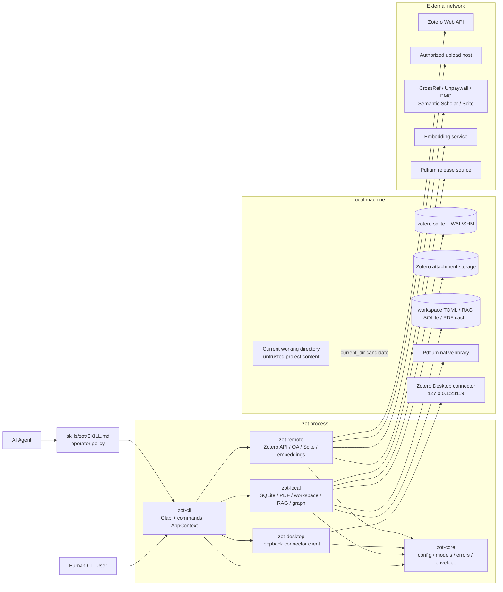
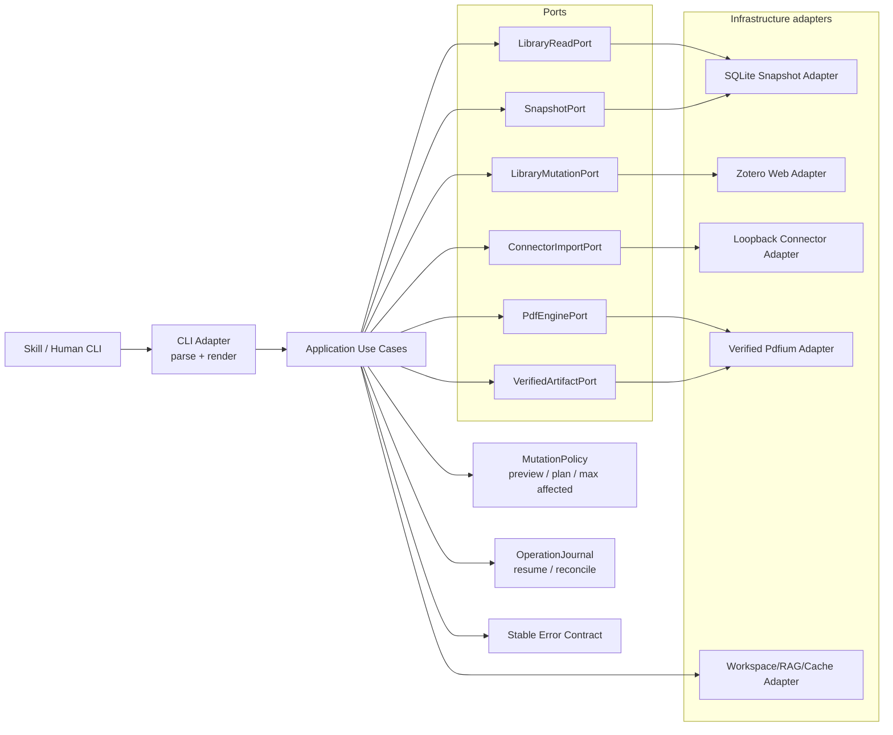

# zotero-cli 极度详细代码审计与架构评审报告

> 仓库：`bahayonghang/zotero-cli`
> 审计快照：`dfc672bfcea344260c03abbcb5ef213edd116407`（`main`）
> 审计日期：2026-07-25
> 审计方式：GitHub 固定提交静态审计、跨文件调用链核对、公开协议契约核对
> 重要限制：当前执行环境无法可靠克隆并运行该仓库，因此**未实际执行** `cargo check`、`cargo test`、`cargo clippy`、覆盖率、benchmark、真实 Zotero 数据库并发测试。所有动态结论均明确标注为「⚠️ 需验证」。

---

## 审计结论总览

本仓库已经不是一个简单 CLI，而是一个面向人类与 AI agent 的 Zotero 运行时，包含本地只读查询、Pdfium 原生库加载、Zotero Desktop loopback connector、Zotero Web API 写入、附件上传、知识图谱、workspace/RAG、第三方学术 API 与 embedding。

代码具备明显的工程化投入：crate 拆分方向正确，远程更新普遍采用版本前置条件，connector 强制 loopback，PDF 阻塞工作已迁移至 `spawn_blocking`，JSON 成功输出集中化，merge/dedupe 具有 pure-plan seam，核心模块存在较多 inline tests。

但当前仍存在一个可在推荐操作路径中触发的 **P0 本地代码执行问题**，以及多项凭据泄漏、数据一致性、路径边界、批量写入安全与大库可扩展性问题。以 `1.0.0` 的稳定性预期衡量，当前安全与可靠性边界尚未达到 production-grade agent runtime 水平。

---

# 0. 执行摘要（TL;DR）

## 0.1 仓库概况

| 项目 | 结论 |
|---|---|
| 领域 | Zotero CLI / agent runtime / reference-management automation |
| 语言与版本 | Rust 2024 edition，声明 MSRV 1.85 |
| Workspace | 5 个 crate：`zot-core`、`zot-local`、`zot-desktop`、`zot-remote`、`zot-cli` |
| 本地存储 | Zotero `zotero.sqlite` 只读访问；workspace、RAG index、PDF cache 为自有 sidecar |
| 本地集成 | Zotero Desktop built-in connector，限制为 loopback HTTP |
| 远程集成 | Zotero Web API、CrossRef、Unpaywall、PMC、Semantic Scholar、Scite、embedding service |
| 原生依赖 | Pdfium 动态库；支持自动下载 |
| Agent 接口 | `skills/zot/SKILL.md` + `zot --json` envelope |
| 代码规模 | 精确 LOC 未测；已确认 5 crate、多层 command/adapter、`db.rs` 接近 2,000 行，属于中等规模 Rust 应用 |
| 测试 | 多个模块含 inline unit/fake-server tests；覆盖率、跨平台和真实集成覆盖未测 |
| 成熟度评分 | **5.6 / 10** |
| 定位判断 | 功能丰富的 Beta/RC；修复 P0/P1 前，不建议按 production-grade `1.0` 安全边界对外承诺 |

### 成熟度分项

| 维度 | 评分 | 依据 |
|---|---:|---|
| 架构分层 | 7.0 | crate 边界基本合理，`core/local/desktop/remote/cli` 方向清楚；但缺 application/use-case 层 |
| 代码质量 | 6.6 | 命名与错误模型整体可读，存在 pure functions 与 fake seams；核心文件职责仍过重 |
| 工程化 | 4.8 | 有 CI，但仅 Ubuntu stable；未完整执行 `just ci`；无 MSRV、跨平台、依赖审计与 release smoke gate |
| 安全 | 3.4 | CWD 动态库劫持、API key 跨域发送、未校验原生二进制、路径逃逸 |
| 健壮性 | 5.0 | 远程 optimistic concurrency 较好；SQLite snapshot、merge partial state、sidecar 并发不足 |
| 性能 | 4.9 | search 全量 hydration、duplicate O(N²)、graph 全库 materialization、文件整包缓冲 |
| 可维护性 | 6.0 | 文档与代码存在控制面漂移，配置项有 silent no-op，CLI 直接编排 concrete adapters |

## 0.2 最关键风险（按影响排序）

1. **🔴 P0：`zot doctor` 可从当前工作目录加载恶意 Pdfium 动态库并执行任意 native code。**
   `doctor` 是 README/AGENTS/skill 推荐的首个命令；在不可信仓库目录执行时，只需放置平台同名 `pdfium.dll` / `libpdfium.so` / `libpdfium.dylib` 即可进入加载候选。

2. **🟠 P1：附件上传会将 Zotero API key 发送给授权上传 URL 所在主机。**
   通用 `http_post()` 无条件附加 `zotero-api-key`，而上传 URL 是 API 返回的外部目标。该 header 不属于文件上传请求。

3. **🟠 P1：对正在运行的 Zotero 数据库使用 `immutable=1`，fallback 又手工分步复制 DB/WAL/SHM。**
   这不是安全快照；并发写入时可读到陈旧或内部不一致状态，并使后续 agent 远程写操作建立在错误事实之上。

4. **🟠 P1：workspace 名称只在 `create` 校验，`load/delete/save/RAG open` 可路径逃逸。**
   `../../x`、绝对路径或 Windows 路径可访问 workspace root 之外的 `.toml` / `.idx.sqlite`。

5. **🟠 P1：写安全策略主要存在于 `SKILL.md`，runtime 未统一强制。**
   `item tag batch` 等批量写入无 preview/confirm/plan token；中途失败时既可能部分生效，也没有 durable operation ledger。

6. **🟠 P1：`--json` 错误协议不稳定。**
   只有能 downcast 为 `ZotError` 的错误进入 JSON envelope；其他 `anyhow::Error` 退化为纯文本 stderr，与公开 contract 冲突。

7. **🟠 P1：duplicate detection 固定只读前 10,000 条，并进行最坏 O(N²) 标题比较。**
   大库既会静默漏检，又可能出现数千万次相似度比较。

## 0.3 值得保留的设计

- `zot-core` 作为 config/model/error/envelope 公共层，方向正确。
- `zot-desktop` 强制 HTTP + loopback host，显著降低 connector override 的 SSRF 风险。
- 远程 item/collection 更新大多先 GET version，再发送 `If-Unmodified-Since-Version`。
- `CommandOutput` 集中了成功响应的 human/JSON 分支。
- PDF command 已通过 `run_pdf` / `spawn_blocking` 避免直接阻塞 Tokio worker。
- merge/dedupe 中 pure plan 与 writer seam 便于故障注入测试。
- graph 构建强调 deterministic ordering，测试可复现性较好。
- `Cargo.lock` 当前锁定 `tar 0.4.45`；已公开的两项 `tar < 0.4.45` RustSec 公告不适用于该锁定版本。

---

# 1. 问题清单

## 1.1 🔴 P0 致命

| 维度 | 位置（file:line） | 证据 | 影响 / 二阶风险 | 根因 | 修复建议 | 工作量 | 信心 |
|---|---|---|---|---|---|---:|---|
| 安全｜客观缺陷 | `src/zot-cli/src/commands/doctor.rs:28-33`；`src/zot-local/src/pdf.rs:152-167,181-216,599-642` | `doctor` 无条件调用 `PdfiumBackend::status()`；`status()` 进入 `pdfium(ProbeOnly)`；候选路径包含 `current_dir().join(library_name)`，随后调用 `Pdfium::bind_to_library()` | 在任意不可信项目目录执行推荐命令 `zot --json doctor`，均可能加载项目内恶意 native library，导致当前用户权限下任意代码执行、凭据窃取和 Zotero 数据外泄 | 将“portable deployment”与“当前工作目录可信”错误等同；native library discovery 缺少 trust policy | **立即删除 CWD 候选**；显式 env override 必须 opt-in；受管 cache 必须校验；system/executable-adjacent 路径需检查目录所有者与可写权限；添加候选路径单测和安全回归测试 | 0.5–1d 热修；2–3d 完整 hardening | 高 |

### P0-01 攻击路径

```text
用户/Agent 进入第三方仓库
  -> 仓库含 libpdfium.so / pdfium.dll / libpdfium.dylib
  -> 按项目说明先执行 zot --json doctor
  -> doctor -> PdfiumBackend::status()
  -> candidate_library_paths() 包含 current_dir
  -> bind_to_library(恶意文件)
  -> native code 在 zot 进程内执行
```

**最强反驳：** CWD 支持把 Pdfium 与项目一起携带，使用方便。
**结论：** 仓库已经支持显式环境变量和 executable-adjacent 部署；CWD 对 agent/dev-tool 是典型不可信边界，便利性不足以抵消默认路径 RCE。

---

## 1.2 🟠 P1 严重

| 维度 | 位置（file:line） | 证据 | 影响 / 二阶风险 | 根因 | 修复建议 | 工作量 | 信心 |
|---|---|---|---|---|---|---:|---|
| 安全｜客观缺陷 | `src/zot-remote/src/zotero.rs:68-72,371-408` | `http_request()` 对任意 URL 无条件加 `zotero-api-key`；文件上传调用 `self.http_post(upload_url)` | API key 被发送到上传主机；一旦授权 URL、测试 override、代理或上游服务被劫持，可直接泄露读写凭据 | 将 Zotero API origin authentication 与通用 HTTP transport 绑定在同一 builder | 拆分 `zotero_request()` 与 `raw_request()`；上传 URL 使用裸 `reqwest::Client::post()`；强制 HTTPS；测试分别启动 API server 与 upload server，断言后者绝无 key header | 0.5–1d | 高 |
| 供应链安全｜客观缺陷 | `src/zot-local/src/pdf.rs:736-846` | 下载 `.tgz` 到内存，允许 5 次 redirect；无 SHA-256/签名、无 size cap；直接 `unpack()` 到最终可加载路径 | 上游 release/CDN compromise、错误资产、截断下载或并发首次安装均可能产生可执行恶意/损坏 native library | 把 HTTPS 当作产物完整性；下载、验证、安装未分阶段 | 内置 version+platform checksum manifest；临时文件下载、限流、hash/signature verify、`fsync`、原子 rename、进程锁；验证失败绝不覆盖旧版本 | 2–4d | 高 |
| 数据一致性｜客观缺陷 | `src/zot-local/src/db.rs:1460-1493` | 主路径使用 `file:...?mode=ro&immutable=1` 读取正在变化的 `zotero.sqlite`；失败后分别复制 DB/WAL/SHM，sidecar copy error 被忽略 | 并发 Zotero 写入时可读取过期/不一致页面；fallback 可能生成非一致 snapshot；agent 随后可能错误 merge/tag/delete | 为避免锁冲突，使用了不适合 live DB 的 immutable 假设；手工复制替代 SQLite snapshot primitive | 主路径用普通 read-only locking；需要快照时使用 SQLite Backup API；禁止手工拼 DB/WAL/SHM；为锁冲突提供明确 retry/hint | 2–4d | 高 |
| 文件系统安全｜客观缺陷 | `src/zot-local/src/workspace.rs:44-129,970-983`；`src/zot-local/src/workspace_rag.rs:31-38` | 仅 `create()` 调用 `ensure_workspace_name()`；`path_for/load/delete/save` 与 RAG index 直接 `root.join(format!("{name}..."))` | 可读/写/删 workspace root 之外的 `.toml`，并在任意目标创建/open `.idx.sqlite`；绝对路径会覆盖 root join | validation 不在类型边界，路径构造函数返回裸 `PathBuf` | 引入 validated `WorkspaceName` newtype；所有入口 parse；`path_for` 私有且返回 `Result`；拒绝 absolute、separator、`..`、Windows prefix；做 parent containment check | 1–2d | 高 |
| Agent 写安全｜客观契约缺陷 | `README.md:64-65,205-213`；`skills/zot/SKILL.md:150-182`；`src/zot-cli/src/cli/args.rs:560-574`；`src/zot-cli/src/commands/item/tag.rs:43-84` | 文档承诺 explicit permission / dry-run gate；但 tag batch 无 `confirm`，匹配后逐项立即远程更新 | Agent 错误筛选可批量修改；第二步失败会留下部分成功状态；调用者无法区分未执行、部分执行和全部执行 | 安全策略只存在 prompt/skill，application runtime 没有统一 mutation policy | 引入 `MutationPlan`：preview 输出 plan id、affected count、version snapshot；`--apply-plan` 才执行；设置 `--max-affected`；所有 batch/destructive 命令统一 ledger | 3–6d | 高 |
| API 稳定性｜客观契约缺陷 | `src/zot-cli/src/main.rs:17-27`；`README.md:166-174`；`src/zot-cli/src/commands/graph/server.rs:24-60` | `main` 仅对 `ZotError` 输出 JSON；其他 `anyhow` 错误直接 `eprintln!`；部分 long-running 命令自行打印 | Agent 解析器在错误路径收到非 JSON，可能误判、丢失错误 code 或产生重试风暴 | typed domain error 与 generic orchestration error 并存；protocol boundary 不统一 | 定义统一 `AppError`/`ErrorEnvelope`；main 对任何 error chain 生成稳定 code；debug chain 仅在 `--verbose`；建立全命令失败 golden tests | 1–2d | 高 |
| 性能与正确性｜客观缺陷 | `src/zot-local/src/db.rs:1116-1199` | duplicate scan 内部固定 `limit: 10_000`；标题模式对 item 两层循环并计算 normalized Levenshtein | 超过 10k 的库静默漏检；10k 时接近 5,000 万 pair comparisons，CLI 可长时间占用 CPU | 先全量加载，再 brute-force pairwise matching；`limit` 同时承担安全阀和业务语义 | DOI 用 SQL/inverted grouping；标题先按 normalized prefix/token/year/author blocking，再对候选计算 edit distance；取消 silent cap，改显式 budget/continuation | 3–7d | 高 |

---

## 1.3 🟡 P2 中等

| 维度 | 位置（file:line） | 证据 | 影响 / 二阶风险 | 根因 | 修复建议 | 工作量 | 信心 |
|---|---|---|---|---|---|---:|---|
| 凭据安全｜客观缺陷 | `src/zot-cli/src/context.rs:28-36`；`src/zot-core/src/config.rs:51-58,89-130` | `AppContext::Debug` 输出完整 `AppConfig`；config struct derive `Debug`，包含 Zotero、embedding、Semantic Scholar key | 测试失败、未来 tracing、panic diagnostics 或 debug log 可泄漏 secret | secret 使用裸 `String`，Debug policy 未封装 | `SecretString`/secrecy crate；config 自定义 redacted `Debug`；禁止对 context/config 直接 debug | <0.5d | 高（触发面中） |
| 配置持久化安全｜客观缺陷 | `src/zot-core/src/config.rs:133-186` | `std::fs::write()` 直接覆盖后才在 Unix chmod 0600；非原子；Windows 无 ACL 策略 | 新文件在 chmod 前可能受 umask 影响；进程崩溃可截断含凭据的 config；Windows 权限不可控 | 写入、权限、durability 未构成原子事务 | 同目录 temp，创建时即 restrictive permissions，write+sync+atomic replace+directory fsync；Windows 记录 ACL 检查结果 | 1–2d | 高 |
| 配置路径安全｜客观缺陷 | `src/zot-core/src/config.rs:133-138,283-317` | 无系统 config/home dir 时 fallback `"."` | 凭据可能被写入当前仓库并被误提交；数据目录也可能错误落到 CWD | fail-open fallback | 对 secret config fail closed；要求显式 `ZOT_CONFIG_DIR`，或使用不可用错误 | 0.5d | 高 |
| UTF-8 健壮性｜客观缺陷 | `src/zot-core/src/config.rs:332-336` | `&value[value.len()-4..]` 按 byte index 截取 | 非 ASCII key 若边界落在多字节字符中会 panic | 混淆 byte length 与 char boundary | `value.chars().rev().take(4)` 或只显示 key fingerprint | <0.25d | 高 |
| 输出元数据正确性｜客观缺陷 | `src/zot-cli/src/context.rs:41-52`；`src/zot-core/src/config.rs:189-207,250-254`；`src/zot-cli/src/output.rs:53-60` | config 可从 default profile materialize；`ctx.profile` 却只保存显式 CLI 参数，envelope 可能输出 `null` | Agent 无法确认实际生效 profile；多 library 环境下审计信息错误 | effective selection 与 materialization 分离但 context 未使用现有 helper | context 保存 `effective_profile_name()`；同时输出 scope/library id 的非敏感 fingerprint | <0.5d | 高 |
| 配置契约｜客观缺陷 | `src/zot-core/src/config.rs:37-49`；`src/zot-cli/src/cli/args.rs:218-315` 等 | `output.default_format` 与 `output.limit` 仅在 config command 中读写；业务命令使用 Clap 硬编码 default | 用户配置成功但运行行为不变，属于 silent no-op | 配置模型与 CLI default resolution 未连接 | 删除未支持项，或在 parse 后统一 `resolve_effective_options()`；加 config→command integration test | 0.5–1d | 高 |
| HTTP 兼容性｜客观缺陷 | `src/zot-remote/src/zotero.rs:68-91` | Zotero 请求没有显式 `Zotero-API-Version` header | 上游默认 API 版本变化时行为不可控 | transport builder 未集中声明协议版本 | 固定当前支持版本；将 API version 纳入 client config 与测试 | <0.5d | 高 |
| HTTP 韧性｜客观缺陷 | `src/zot-remote/src/http.rs:26-41,78-107` | 有 timeout，但无 429/5xx retry、jitter、`Retry-After`；error body 全量拼进 message | 限流时批量任务脆弱；错误响应可过大或包含敏感/控制字符 | transport 只统一错误映射，没有 resilience policy | 对 idempotent GET 和有 write token 的请求做 bounded retry；尊重 `Retry-After`；error body 限长并 sanitize | 2–3d | 高 |
| 网络安全/资源安全｜客观缺陷 | `src/zot-remote/src/oa.rs:164-274`；`src/zot-cli/src/commands/item/write.rs:270-353` | 第三方返回 URL 直接 `GET`；无 scheme/private-IP/redirect policy、size cap、Content-Type 或 `%PDF-` 校验；整包 `.bytes()` | 被污染的 OA 元数据可引导访问内网或下载巨型/非 PDF 内容；内存与磁盘压力；HTML 可被上传为 PDF | 将学术 provider 响应视为可信资源 locator | `https` allow policy；每次 redirect 后重验 DNS/IP；拒绝 loopback/private/link-local；stream 到 temp；大小上限；PDF magic + content-type 校验 | 2–4d | 中高 |
| 附件一致性｜客观缺陷 | `src/zot-remote/src/zotero.rs:371-408`；`src/zot-cli/src/commands/item/write.rs:253-268` | 先创建 attachment/item，再授权/上传；任一步失败未清理；上传 payload 重新拼成完整 Vec | 失败留下 orphan child/item；大 PDF 产生多份峰值内存 | Web API 两阶段操作无 compensation；上传接口仅接受完整 bytes | 失败时 best-effort 删除 orphan，并返回 cleanup 状态；可流式上传时改 stream；至少限制最大附件大小 | 2–3d | 高 |
| Merge 数据完整性｜客观缺陷 | `src/zot-cli/src/commands/item/merge.rs:105-123,300-316` | 顺序为更新 keeper→逐 child reparent→逐 source trash；`operation_id` 参数未使用；`already_applied` 固定 false | 中途失败只能收到 error，无法知道完成到哪一步；重试与审计依赖重新推断远程状态 | 上游无 transaction，但本地也无 durable saga/step journal | operation journal 记录版本与每步结果；resume/reconcile；失败输出 partial ledger；用 write token 做幂等关联 | 3–5d | 高 |
| Search 性能｜客观缺陷 | `src/zot-local/src/db.rs:137-228` | 先将所有候选 ID 放入 `HashSet`，多个 filter 再扫描，随后 hydrate 全部 item、内存排序，最后才 `skip/take` | 即使 `--limit 50`，峰值仍近 O(N)；大库启动延迟和内存明显 | pagination/sort/filter 未下推 SQL | 建立 query builder/CTE；SQL `ORDER BY/LIMIT/OFFSET`；批量关联聚合 creators/tags；必要时两阶段仅 hydrate page | 4–8d | 高 |
| SQL N+1｜客观缺陷 | `src/zot-local/src/db.rs:250-281` | `get_notes()` 对每个 note 单独 `get_item_tags(note_item_id)` | note 多时查询数为 1+N | 缺 batch tag loader | 一条 join 聚合或一次 `WHERE itemID IN (...)` 批量加载 | 0.5–1d | 高 |
| 业务语义｜客观缺陷 | `src/zot-local/src/db.rs:74-105,121-134`；stats 查询 `src/zot-local/src/db.rs:1298-1393` | `SearchOptions::default().exclude_trashed=false`，普通 list/search 返回 trash；stats 也未统一排除 deleted items | Agent 搜索结果和统计可包含已删除记录，随后可能对 trash item 执行写操作 | 为兼容旧行为把异常状态设为默认 | 默认排除；新增 `--include-trashed`；在 envelope meta 标注 trash policy | 1–2d | 高 |
| Graph 可扩展性｜客观缺陷 | `src/zot-local/src/db.rs:1282-1293`；`src/zot-local/src/graph.rs:203-218` | 全库 `usize::MAX` 加载；每个 author/tag/collection group 生成所有 unordered pairs | 大库或高频 tag 可产生大量边与内存；已有 `max_group_size` 仅部分缓解 | 全量 materialization + pair expansion | 支持 collection/window/edge budget；SQL 预聚合；超大 group 采样或 hub representation；显示 truncation meta | 3–6d | 中高 |
| Async 运行时｜架构缺陷 | 多个 `async fn` command 内直接调用 `LocalLibrary` 同步 rusqlite；如 `src/zot-cli/src/commands/item/annotation.rs:11-37` | PDF 已使用 `spawn_blocking`，但重 search/graph/workspace SQL 仍在 Tokio task 内同步运行 | 未来 MCP/daemon 模式下会阻塞 worker，增大 tail latency | 只对 PDF 做了 blocking boundary，没有统一 local I/O executor | 引入 `LocalExecutor`，重查询统一 `spawn_blocking`；或将 CLI 与长期 server runtime 分离 | 2–4d | 中 |
| PDF cache 正确性/并发｜客观缺陷 | `src/zot-local/src/pdf.rs:485-539,862-874` | cache key 仅 path+mtime+length，并用 MD5 作为非安全 fingerprint；cache DB 未启用 WAL/busy timeout | 同长度且保留 mtime 的替换可命中陈旧文本；并发 CLI 可能 `database is locked` | 便宜 fingerprint 与单进程假设 | 优先 Zotero attachment md5；否则 content hash/strong metadata；sidecar 统一 WAL、busy timeout、schema version | 2–3d | 高 |
| Web UI 安全｜客观缺陷 | `src/zot-cli/assets/graph/app.js:143-160`；`src/zot-cli/src/commands/graph/server.rs:79-95` | item URL 进入 `href`，仅 HTML escape，不限制 scheme；`target=_blank` 无 `noopener`；server 无 CSP/nosniff | 用户点击 `javascript:`/危险 custom scheme 可执行或触发外部 handler；本地 origin 降低但不消除风险 | 字符串 escape 被当作 URL policy | DOM API 创建元素；只允许 `http/https`（DOI 单独生成）；`rel=noopener noreferrer`；CSP `default-src 'self'` | 0.5–1d | 高 |
| 文件写安全｜客观缺陷 | `src/zot-cli/src/commands/item/read.rs:122-165,223-235` | attachment filename 直接 join 到 output dir；`fs::copy` 默认覆盖已存在文件 | 恶意/异常 filename 可逃逸目录；默认覆盖用户已有文件 | 未区分 metadata filename 与安全 basename；无 no-clobber policy | `file_name()` sanitize、拒绝 separator/absolute；默认 `create_new`，显式 `--force` 才覆盖 | 0.5–1d | 高 |
| 输入校验｜客观缺陷 | `src/zot-cli/src/commands/item/annotation.rs:136-167` | area annotation 对 `x/y/width/height` 无 finite/range/positive validation | NaN、inf、负数、越界矩形可生成无效 annotation payload | Clap 只完成解析，不等于领域约束 | 验证 finite；`0<=x,y<1`；`width,height>0`；边界和不超过 1 | <0.5d | 高 |
| 标识解析｜客观缺陷 | `src/zot-local/src/db.rs:1499-1513` | collection 通过 `key = ? OR collectionName = ?` 并用单行查询 | 同名 collection 时选择不确定，批量导入/搜索可能作用于错误集合 | 将非唯一 display name 当 identifier | key 优先；名称匹配 0/1/>1 分支；多匹配时报 ambiguity 并返回候选 keys | 0.5d | 高 |
| Connector TOCTOU｜客观缺陷 | `src/zot-cli/src/commands/item/import.rs:33-68`；`src/zot-desktop/src/connector.rs:174-230` | 先读取 selected target 并验证 writable，随后另一个请求才 import；期间 UI selection 可改变 | preview/JSON 显示 target A，实际记录可能进入 B | connector API 本身按“当前选择”工作，target 没有绑定 token | confirm 前再次获取 target 并比较 fingerprint；变化则 abort；结果明确注明 target 由 Zotero 最终决定 | 1d | 中 |
| CI 覆盖｜客观工程缺陷 | `.github/workflows/ci.yml:16-52` | 仅 `ubuntu-latest` + stable；无 Windows/macOS/MSRV；cargo gates 无 `--locked`；无 audit/deny、Pdfium/connector smoke | 三平台承诺、Windows registry/path、macOS dylib、原生下载路径均无 PR gate | CI 只覆盖基础 Rust 编译 | matrix：Ubuntu/Windows/macOS；单独 MSRV 1.85；`--locked`；`cargo audit/deny`；平台 smoke；release artifact install test | 1–3d | 高 |
| Lint 继承｜客观工程缺陷 | 根 `Cargo.toml:60-67`；`src/zot-cli/Cargo.toml:13-14`；其他四个 member manifest | workspace 定义 lint，但只有 `zot-cli` 显式 `[lints] workspace=true` | `unsafe/dbg/todo/unwrap` policy 并未覆盖 core/local/desktop/remote | 误以为 workspace lints 自动继承 | 所有 member 添加 `[lints]\nworkspace=true`；加 manifest guard test | <0.5d | 高 |
| CI 契约漂移｜客观工程缺陷 | `justfile:36-51,74-78`；`.github/workflows/ci.yml:38-52` | `just ci` 先执行 `version-sync` 并改写 skill 文件；GitHub CI 并未执行 `version-check/skills-check` | 本地“CI”不是纯验证；版本漂移可被自动改写掩盖；远端与本地 gate 不一致 | generation 与 verification 混在同一 recipe | 拆分 `version-sync` 与 `version-check`；CI 只 check，并执行 `git diff --exit-code`；workflow 直接运行 `just ci-check` | 0.5–1d | 高 |
| Agent 控制面文档｜客观缺陷 | `AGENTS.md:9-15,62-65`；根 `Cargo.toml:4-10`；`.github/workflows/ci.yml` | AGENTS 仍写 4 crate、无 CI，而实际有 5 crate 与 CI | Agent 会忽略 `zot-desktop`，错误判断测试/修改流程 | 文档更新未纳入 release gate | 从 workspace metadata 生成 map；文档 assertions；每次架构变更强制更新 | 0.5d | 高 |
| Release 文档｜客观缺陷 | 根 `Cargo.toml:13-19`；`CHANGELOG.md:8-107` | workspace version 已为 1.0.0，而 CHANGELOG 最新正式条目仍为 0.6.0 | 下游无法判断 1.0 breaking changes、security posture 与 migration | release checklist 不闭环 | 补 1.0.0 changelog；自动校验当前 version 存在对应 heading/tag/release notes | 0.5–1d | 高 |
| Doctor 能力判定｜客观缺陷 | `src/zot-cli/src/commands/doctor.rs:199-210` | `web_write.available` 仅等于 credentials 非空，明确 `checked: credentials-only` | 人类只看 `available=true` 时可能误认为 key 有效、有 scope、有权限 | configured 与 verified 混为一个字段 | 输出 `configured`、`verified`、`permissions`、`last_error`；可选执行轻量 key info endpoint | 0.5–1d | 高 |

---

## 1.4 🟢 P3 轻微

| 维度 | 位置（file:line） | 证据 | 影响 / 二阶风险 | 根因 | 修复建议 | 工作量 | 信心 |
|---|---|---|---|---|---|---:|---|
| 配置 UX｜客观缺陷 | `src/zot-cli/src/commands/config.rs:262-280` | `config init --target-profile` 对 root-only setting 静默忽略，而 `config set` 会报错 | 自动化认为设置成功，实际未生效 | 为兼容历史行为保留 silent ignore | 两条路径统一 fail-fast；或返回 `ignored_settings` | <0.5d | 高 |
| 解析健壮性｜设计债 | `src/zot-remote/src/oa.rs:28-49,303-340` | arXiv Atom XML 通过 regex 提取 title/summary/author | XML namespace、嵌套元素、实体或 author affiliation 可能导致误解析 | 以简单响应形状换低依赖 | 使用 streaming XML parser；保留 malformed fixture | 1–2d | 中 |
| 依赖卫生｜客观工程缺陷 | 根 `Cargo.toml` workspace dependencies；`src/zot-cli/Cargo.toml:20-39` | workspace 仍声明 `rmcp`，CLI 当前未依赖，MCP 也明确未实现 | 增加维护噪声和误导，不直接进入 crate dependency graph | 旧 scaffold 残留 | 删除直到 MCP 实现；用 `cargo machete/udeps` gate | <0.5d | 高 |
| 可维护性｜设计债，非纯客观 bug | `src/zot-local/src/db.rs` 全文件 | 单个 concrete `LocalLibrary` 同时承担 schema、search、notes、tags、duplicates、stats、graph signal、附件路径等 | 修改热点集中、测试 fixture 复杂、查询策略难独立演进 | “集中 SQL”降低初期跳转成本，但职责已超过单模块合理边界 | 按 read model 拆 `ItemQuery/CollectionQuery/AnnotationQuery/DuplicateQuery/GraphQuery`；共享 connection/snapshot provider | 3–8d | 中 |

---

# 2. 架构评估

## 2.1 当前实际架构



## 2.2 核心数据流与控制流

### 本地读取

```text
CLI command
  -> AppContext::local_library()
  -> LocalLibrary::open()
  -> live zotero.sqlite read-only connection
  -> domain model hydration
  -> CommandOutput
```

主要问题不是“直接读 SQLite”本身，而是 snapshot policy：`immutable=1` 不能用于持续变化的 live DB，手工 DB/WAL/SHM copy 也不能保证一致性。

### Web API 写入

```text
CLI command
  -> AppContext::remote()
  -> ZoteroRemote
  -> GET current remote object/version
  -> PUT/PATCH/DELETE with If-Unmodified-Since-Version
```

这个方向合理。问题集中在：

- authentication header 没有 origin scope；
- batch/destructive mutation 缺统一 plan gate；
- multi-step merge 没有 durable saga；
- 429/5xx 没有一致 retry policy。

### Connector import

```text
ping
  -> getSelectedCollection
  -> preview or check writable
  -> POST import against Zotero UI current target
```

loopback validation正确；但 selected target 与 import 之间存在 TOCTOU。

### PDF

```text
doctor/PDF command
  -> candidate native library discovery
  -> bind existing library
  -> otherwise managed download
  -> extract/search/outline
  -> sidecar cache
```

这是当前最危险的 trust boundary：CWD、system、managed cache、network release source 被混在同一 discovery function 中。

## 2.3 依赖方向评价

### 合理部分

- `zot-core` 不反向依赖 adapters。
- `zot-local`、`zot-desktop`、`zot-remote` 相互独立。
- `zot-cli` 作为 composition root 依赖全部实现，符合 binary crate 常见模式。
- 未发现已证实的 crate circular dependency。

### 主要架构反模式

| 现状 | 反模式 | 二阶问题 | 目标 |
|---|---|---|---|
| CLI command 直接调用 concrete `LocalLibrary/ZoteroRemote/ConnectorClient` | 缺 application/use-case 层 | 安全 gate、retry、audit、partial-state policy 分散 | `ApplicationService` + narrow ports |
| `SKILL.md` 承担写权限策略 | Prompt-only policy | 直接 CLI 或其他 agent 绕过 | Runtime-enforced `MutationPolicy` |
| `ZoteroRemote::http_request` 自动对任意 URL加 key | Ambient authority | 凭据跨 origin | origin-scoped authenticated client |
| Pdfium discovery 同时负责路径发现、下载、安装、加载 | Trust concerns 混杂 | CWD RCE、unsigned binary、race | `NativeArtifactResolver` + `VerifiedInstaller` |
| `LocalLibrary` concrete god object | 高职责聚合 | 查询优化和 schema 演进耦合 | query services + snapshot provider |
| sync rusqlite 嵌在 async command | Blocking boundary 不完整 | server/MCP tail latency | local blocking executor |
| `anyhow` 与 `ZotError` 混用至 protocol boundary | Error taxonomy 泄漏 | JSON contract 不稳定 | single app error contract |
| config struct 持有裸 secret String | Secret-aware type 缺失 | Debug/serialization/write policy分散 | `SecretString` + secret store |

## 2.4 推荐目标架构



关键点不是为了“多一层而多一层”，而是让以下 cross-cutting rules 只有一个执行位置：

- credential origin scope；
- preview/confirm/plan；
- retry/idempotency；
- operation journal；
- JSON error envelope；
- blocking I/O boundary；
- metrics/tracing；
- input/path/URL policy。

---

# 3. 关键问题深挖

## 3.1 API key 跨域发送

### 当前控制流

```text
Zotero API authorization request
  -> response.auth.url
  -> ZoteroRemote::http_post(auth.url)
  -> http_request() 自动加 zotero-api-key
  -> 请求发送至 auth.url host
```

### 这不是“header 多余”这么简单

- Zotero key 可能包含写权限。
- upload URL 不需要该 key；上传自身依赖 authorization payload。
- 任何未来测试 base URL、自托管 proxy、上游错误返回或供应链 compromise 都会接收 key。
- `reqwest` 的重定向 header policy不能替代这里的修复，因为 key 在初始请求就已经发给外部 URL。

### 推荐 API

```rust
impl ZoteroRemote {
    fn zotero_request(&self, method: Method, endpoint: Url) -> RequestBuilder {
        debug_assert!(self.is_zotero_origin(&endpoint));
        self.client
            .request(method, endpoint)
            .header(ZOTERO_API_KEY_HEADER, self.api_key.expose_secret())
            .header(ZOTERO_API_VERSION_HEADER, SUPPORTED_API_VERSION)
    }

    fn external_upload_request(&self, upload_url: Url) -> ZotResult<RequestBuilder> {
        validate_https_external_url(&upload_url)?;
        Ok(self.client.request(Method::POST, upload_url))
    }
}
```

### 必须有的回归测试

1. fake Zotero API server 收到 API key。
2. fake upload server 收不到 API key、Authorization、Cookie。
3. upload URL 为 `http://` 时 fail closed。
4. upload URL redirect 到 private/loopback 地址时 abort。
5. key 不出现在 error/log/debug snapshot。

## 3.2 SQLite snapshot

### 当前方案的问题

`immutable=1` 的语义不是“只读”，而是调用方承诺文件不会改变。Zotero 运行时数据库显然会改变。使用该参数意味着 SQLite 可以跳过 locking 与 change detection。

fallback 更危险：

```text
copy zotero.sqlite
copy zotero.sqlite-wal if exists
copy zotero.sqlite-shm if exists
open copied main DB read-only
```

三个文件并非在同一个原子时间点复制；复制 WAL 失败还被忽略。即使每个 copy 成功，也不等于同一一致性点。

### 推荐两级策略

**短期安全修复**

- 移除 `immutable=1`。
- 普通 `SQLITE_OPEN_READ_ONLY`。
- 设置合理 busy timeout。
- 如果数据库忙，返回明确 `zotero-db-busy`，而不是生成不可信 snapshot。

**中期正确方案**

- 从 read-only source connection 使用 SQLite Backup API 复制到 temp DB。
- snapshot 建立后所有命令只读 temp。
- snapshot meta 输出 source mtime、snapshot time、schema version。
- 对大库可配置 `--live-read` 与 `--snapshot-read`，默认 snapshot。

### 动态测试

- 一个 writer 连续 commit 多表关联更新。
- reader 并发创建 1,000 次 snapshot。
- 验证 foreign/reference consistency invariant。
- 不允许出现 `SQLITE_CORRUPT`、missing relation、半更新。
- Windows/macOS/Linux 均执行。

## 3.3 Workspace path boundary

修复不应只是“在 delete 前再调用一次 regex”。正确方式是让非法名称无法进入 domain：

```rust
#[derive(Clone, Debug, Eq, PartialEq, Hash)]
pub struct WorkspaceName(String);

impl TryFrom<&str> for WorkspaceName {
    type Error = ZotError;

    fn try_from(raw: &str) -> Result<Self, Self::Error> {
        // reject empty, absolute, separators, parent components,
        // Windows prefixes, trailing dots/spaces, reserved names
    }
}
```

所有接口改为：

```rust
pub fn load(&self, name: &WorkspaceName) -> ZotResult<Workspace>;
pub fn delete(&self, name: &WorkspaceName) -> ZotResult<()>;
pub fn open_rag(&self, name: &WorkspaceName) -> ZotResult<WorkspaceRagStore>;
```

此外要处理 symlink：

- workspace root 创建后 canonicalize；
- target parent canonicalize；
- 必须 `target_parent == root`；
- sidecar 使用 no-follow/open options（平台允许时）。

## 3.4 Agent-first 写操作

### 当前不一致

- merge/dedupe/import：有 preview/confirm。
- tag batch：立即执行。
- note/tag/collection/annotation/saved-search 等：多数直接执行。
- skill 文档要求 permission，但 binary 不知道“用户是否真的批准”。

### 目标模型

```json
{
  "ok": true,
  "data": {
    "plan_id": "mut_...",
    "operation": "tag_batch",
    "matched": 47,
    "sample_keys": ["..."],
    "preconditions": {
      "library": "user:hash",
      "versions": {"KEY1": 123}
    },
    "expires_at": "...",
    "confirm_required": true
  }
}
```

执行：

```bash
zot --json mutation apply mut_...
```

必要 guardrails：

- `--max-affected` 默认 20；超过必须显式提高。
- plan 绑定 profile/library/scope。
- plan 绑定远程 object versions。
- plan 短期过期。
- 每步记录 outcome。
- partial failure 返回 `state: partial` 和 resume token，而不是只返回 generic error。
- `--yes` 只能跳过交互，不应跳过 max affected/version checks。

## 3.5 JSON protocol

建议把 CLI 视为一个 versioned local API，而不是“尽量输出 JSON”的命令行程序。

```rust
enum AppError {
    Domain(ZotError),
    Serialization { code: &'static str, source: serde_json::Error },
    Runtime { code: &'static str, source: anyhow::Error },
}
```

必须保证：

- `--json` 模式 stdout 只出现一个 JSON document，或明确的 JSONL protocol。
- human diagnostics 进入 stderr。
- 所有错误都有稳定 `code`。
- `meta.api_version` 在成功与失败一致。
- long-running server 命令声明独立 protocol，不冒充普通 envelope。
- panic 不作为用户输入/远程异常处理方式。

---

# 4. 性能分析

## 4.1 Search

当前复杂度近似：

```text
候选 ID 搜索：O(N)
多个 filter set：O(N)
hydrate 全部候选：O(N × associations)
内存排序：O(N log N)
最后 pagination：O(limit)
```

`limit=50` 没有降低主要成本。

### 目标

- SQL 生成候选 page IDs；
- `ORDER BY/LIMIT/OFFSET` 下推；
- creators/tags/collections 用 batch aggregation；
- total count 单独查询；
- 对 fulltext 建 FTS5 或明确使用 Zotero 已有全文表的索引策略；
- query plan 基准纳入测试。

目标复杂度：

```text
index/filter: O(log N + matches)
page hydration: O(limit + associated rows)
sort: DB index or O(page log page)
```

## 4.2 Duplicate detection

当前：

- DOI grouping：O(N)，合理。
- title：最坏 O(N² × title-distance-cost)。
- 先截 10,000，导致 correctness 与 performance 同时失真。

推荐 blocking keys：

```text
normalized first 12 chars
year bucket
first author normalized surname
token minhash / trigram bucket
DOI exact
ISBN exact
```

只对共享 block 的 pairs 做 Levenshtein。输出：

- scanned count；
- candidate pair count；
- skipped oversize block；
- threshold；
- continuation cursor；
- truncated=false/true。

## 4.3 Graph

当前 inverted group 后进行 pair expansion，复杂度约：

```text
O(N + Σ author_group² + Σ tag_group² + Σ collection_group²)
```

`max_group_size` 能防单个超大 group，但仍可能有大量中等 group。

可选改进：

- 预先估算 edge budget；
- top-k neighbors per node；
- 高流行 tag 作为 hub/bipartite node 而非 clique；
- collection scope 默认；
- 大库输出 warning 和 sampled/limited metadata。

## 4.4 文件与网络内存

- Pdfium archive 全量读取到 `Vec<u8>`。
- OA PDF 全量 `.bytes()`。
- attachment upload 又构建 `prefix + file + suffix` 新 `Vec`。

多个路径峰值可接近 2–3 倍文件大小。应使用：

- streaming download；
- Content-Length + hard cap；
- temp file；
- multipart streaming（协议允许时）；
- upload progress/timeout；
- cleanup guard。

---

# 5. 安全模型

## 5.1 信任边界

| 区域 | 默认信任级别 | 说明 |
|---|---|---|
| 当前工作目录 | 不可信 | 可能是任意第三方 Git repository；不得作为 native library source |
| Zotero SQLite | 可信数据、但持续变化 | 不能假设 immutable；内容字段仍可能包含恶意 URL/terminal control |
| Zotero attachment filename | 不可信输入 | 不能直接作为输出路径 |
| Loopback connector | 本机可信度较高 | 已正确限制 loopback；仍有 UI selection TOCTOU |
| Zotero API response | 可信协议输入、仍需验证 | upload URL 不应继承 API key |
| 第三方 OA provider response | 不可信 external metadata | URL 需要 SSRF、scheme、size、content validation |
| Pdfium release source | 供应链输入 | 必须 checksum/signature verification |
| Config file | 高敏感 | 含多个 API key；需要原子写、权限与 redacted Debug |
| Graph viewer data | 不可信内容 | URL scheme 与 DOM policy 需要限制 |

## 5.2 Secrets

- Zotero API key
- Embedding API key
- Semantic Scholar API key
- 未来 MCP/agent credentials

推荐：

- 内存类型使用 `SecretString`；
- Debug/Serialize 默认不可见；
- config 中仅在明确 persistence layer expose；
- 支持 OS keychain 作为可选 backend；
- doctor 只显示 fingerprint/last-4；
- 网络请求通过 origin-bound credential provider；
- 测试 assert secret 不出现在 logs/errors/snapshots。

---

# 6. 优化 Plan

## 阶段一：Quick Wins（低成本高收益，每项 <1d）

### QW-01 删除 CWD Pdfium 加载

- **动作**：从 `candidate_library_paths()` 删除 `current_dir`；`doctor` probe 只检查 trusted candidates。
- **量化收益**：消除 100% 已识别 CWD dynamic-library hijacking 路径；P0 由 1 降为 0。
- **风险**：依赖“把 Pdfium 放在项目目录”的用户会失效。
- **回滚策略**：提供显式 `ZOT_PDFIUM_LIB_PATH`；不要恢复隐式 CWD。
- **验收**：unit test 断言 candidate list 不含 CWD；从含同名假库的 fixture 目录运行 doctor，不访问该文件。

### QW-02 修复上传 header scope

- **动作**：external upload 使用无认证 request builder。
- **量化收益**：非 Zotero origin 收到 API key 的请求路径从 1 降为 0。
- **风险**：如果现有测试错误依赖该 header，需更新 fixture。
- **回滚策略**：无合理安全回滚；仅可回退整个附件上传 feature。
- **验收**：双 server test；upload server header snapshot 无 key。

### QW-03 WorkspaceName 全入口校验

- **动作**：先在 `path_for/load/delete/save/WorkspaceRagStore::open` 强制调用 validation；随后迁移 newtype。
- **量化收益**：已识别 path traversal sink 5+ → 0。
- **风险**：已有非法命名 workspace 不能直接打开。
- **回滚策略**：提供一次性 migration command，重命名后再访问。
- **验收**：`../`、`..\`、absolute、drive prefix、UNC、Unicode separator、reserved name 全部拒绝。

### QW-04 统一 JSON error boundary

- **动作**：main 对所有 errors 输出 envelope；给 generic error 稳定 code。
- **量化收益**：`--json` error paths contract coverage → 100%。
- **风险**：依赖旧 stderr 文本的脚本需要迁移。
- **回滚策略**：human mode 保留原文；JSON 增加 `legacy_message` 一个 release 周期。
- **验收**：每个 command group 至少一个 forced-error integration test；stdout 可被单次 JSON parse。

### QW-05 临时移除 `immutable=1` 与不安全 fallback

- **动作**：普通 read-only open；忙时 fail explicitly，不做手工 sidecar copy。
- **量化收益**：停止生成“看似成功但一致性未知”的 snapshot。
- **风险**：Zotero 忙时失败率暂时上升。
- **回滚策略**：允许用户关闭 Zotero后重试；中期上线 Backup API。
- **验收**：并发 writer fixture 不出现 inconsistent snapshot。

### QW-06 Secret redaction 与原子 config write

- **动作**：自定义 Debug；修复 UTF-8 redaction；temp+atomic config save。
- **量化收益**：已识别 debug/config disclosure sink 归零。
- **风险**：Windows replace 行为需单独测试。
- **回滚策略**：保留旧 config parser，不回滚权限策略。
- **验收**：secret canary 不出现在 `Debug`、doctor、error；kill-injection 后 config 为旧完整或新完整，不得截断。

### QW-07 CI 基线补齐

- **动作**：所有 crate lint inheritance；cargo commands `--locked`；增加 MSRV；CI 执行纯 check 版 `just ci`。
- **量化收益**：lint coverage 1/5 → 5/5；MSRV gate 0 → 1；lock reproducibility 0/3 → 3/3。
- **风险**：暴露现有 warnings/compatibility issue。
- **回滚策略**：短期 allow list 必须带 issue 与 expiry，不降低全局 gate。
- **验收**：Ubuntu stable + MSRV 通过；working tree clean。

## 阶段二：中期重构

### M-01 SQLite SnapshotProvider

- **前置依赖**：QW-05。
- **动作**：Backup API snapshot、busy timeout、snapshot metadata、concurrency fixtures。
- **预期收益**：本地读 consistency 由“未知”变为 transactionally consistent。
- **回归风险**：大库 snapshot latency、temp disk usage。
- **回滚**：feature flag `live-read`；保留 safe read-only path。
- **验收**：并发写压力测试 10,000 snapshots 无 invariant violation。

### M-02 VerifiedNativeArtifactInstaller

- **前置依赖**：QW-01。
- **动作**：checksum manifest、signature、size cap、lock、atomic install、rollback。
- **预期收益**：native artifact verification 0% → 100%。
- **回归风险**：上游资产更新需要同步 manifest。
- **回滚**：关闭 auto-download，要求 explicit path。
- **验收**：tampered、truncated、wrong-platform、concurrent download tests 全 fail closed。

### M-03 MutationPlan + OperationJournal

- **前置依赖**：统一 AppError、远程 version model。
- **动作**：所有 batch/destructive writes 进入 plan/apply；merge 实现 saga journal。
- **预期收益**：无 preview 的批量 mutation 数量 → 0；partial failure 可恢复率 → 100%。
- **回归风险**：CLI UX 与现有 scripts breaking。
- **回滚**：一个 release 保留 legacy commands，但默认打印 deprecation 且设置低 max affected。
- **验收**：故障注入在每个 step 后 crash，重启可 resume/reconcile，不重复或丢失操作。

### M-04 Query pushdown 与 duplicate blocking

- **前置依赖**：query layer split。
- **动作**：SQL filter/sort/page；batch associations；duplicate candidate blocks。
- **预期收益**：普通 page hydration 从 N 降到 limit；duplicate worst-case 从 O(N²) 降到 O(N log N + candidate pairs)。
- **回归风险**：排序、total、filter 语义变化。
- **回滚**：保留 legacy engine hidden flag用于结果 diff。
- **验收**：golden dataset 结果等价；20k/100k synthetic benchmark 达到预算。

### M-05 HTTP policy middleware

- **动作**：origin-scoped auth、API version、retry/backoff、Retry-After、URL/redirect policy、error sanitization。
- **预期收益**：429/temporary 5xx 成功恢复率显著提高；credential/SSRF policy集中。
- **回归风险**：错误 retry 非幂等写。
- **回滚**：按 operation 类型关闭 retry；保留 metrics。
- **验收**：fake server 覆盖 429、503、412、redirect、slow body、oversize body。

### M-06 Sidecar storage policy

- **动作**：workspace/RAG/PDF cache 统一 WAL、busy timeout、schema migration、atomic replace、corruption recovery。
- **预期收益**：多进程 CLI `database is locked` 和 silent migration loss 显著下降。
- **回归风险**：旧 sidecar migration。
- **回滚**：自动备份旧 DB，失败时重建可再生 index/cache。
- **验收**：多进程并发 index/query/cache test；crash recovery。

### M-07 三平台集成测试

- **动作**：Windows registry/path、macOS dylib、Linux glibc、connector fake、Pdfium install/load、config permissions。
- **预期收益**：承诺平台 CI 覆盖 1/3 → 3/3。
- **回归风险**：CI 成本与 flaky native test。
- **回滚**：native smoke 可 nightly，但 compile/path/security test 必须 PR blocking。
- **验收**：三 OS required checks。

## 阶段三：长期架构演进

### L-01 Application/use-case layer

把 command handler 变成薄 adapter：

```text
parse args
  -> use_case.execute(request)
  -> render typed result
```

use case 统一：

- permission/plan；
- scope/profile；
- retry/idempotency；
- operation journal；
- metrics；
- stable errors。

### L-02 拆分 `zot-local`

建议模块：

```text
snapshot/
queries/items.rs
queries/collections.rs
queries/notes.rs
queries/annotations.rs
duplicates/
graph/
attachments/
workspace/
rag/
pdf/
```

`LocalLibrary` 只保留 facade 或移除，connection ownership 交给 `SnapshotSession`。

### L-03 Release engineering

- `cargo-semver-checks`
- reproducible `--locked`
- SBOM
- signed/checksummed release artifacts
- provenance/SLSA
- release notes/version/tag/skill docs一致性 gate
- security advisory process
- key-rotation notice

### L-04 Observability

引入结构化 tracing，但必须 secret-safe：

- operation id / plan id
- command
- library scope fingerprint
- item count
- remote status
- retry count
- elapsed time
- snapshot age
- partial state
- no raw note/PDF content by default
- no API keys

### L-05 MCP 实现前置条件

当前 MCP 仅 scaffold，这是合理的。实现前必须完成：

1. runtime mutation policy；
2. origin-scoped credentials；
3. stable JSON/error schema；
4. operation journal；
5. resource limits；
6. cancellation/timeouts；
7. per-tool permission declaration；
8. prompt injection 不得改变 runtime guardrails。

---

# 7. 量化指标（Before → Target）

> “Before 未测”不以猜测填数。先建立 baseline，再将下列 target 设为 release gate。

| 指标 | Before | Target |
|---|---:|---:|
| P0 未关闭问题 | 1 | 0 |
| P1 未关闭问题 | 7 | 0 |
| 非 Zotero origin 携带 API key 的已知路径 | 1 | 0 |
| 隐式 CWD native library candidate | 1 | 0 |
| Managed native artifact 完整性验证 | 0% | 100% |
| Workspace path sink 强制 validated name | 1/6 左右 | 100% |
| CI OS | 1/3 | 3/3 |
| MSRV required check | 0 | 1 |
| 继承 workspace lint 的 crate | 1/5 | 5/5 |
| CI cargo gates 使用 `--locked` | 0/3 | 3/3 |
| `--json` 失败路径 envelope 覆盖 | 已证实非 100% | 100% |
| Zotero API version header | 0 | 100% 请求 |
| 429 `Retry-After` 支持 | 0 | 100% eligible requests |
| 普通 search hydrate items | O(N) | O(limit + bounded joins) |
| title duplicate worst case | O(N²)，且 10k silent cap | blocked candidates；无 silent cap |
| note tag query count | 1+N | ≤2–3 |
| OA/Pdfium download size cap | 无 | 显式、可配置；默认安全上限 |
| Merge partial-state 可恢复 | 无 durable ledger | 每步可 resume/reconcile |
| 整体 line coverage | 未测 | ≥75% |
| 安全关键模块 branch coverage | 未测 | ≥90% |
| Mutation failure-path coverage | 未测 | ≥95% 关键分支 |
| `cargo audit/deny` 未处置项 | 未测 | 0 untriaged |
| Search p95（10k/100k fixture） | 未测 | baseline 后设预算；每 release 不回退 >10% |
| `cargo test --workspace` 时长 | 未测 | 建 baseline；PR 不回退 >15% |
| Release version/docs/skill 一致性 | 已存在漂移 | 100% automated gate |

---

# 8. 推荐测试矩阵

## 8.1 Security regression

- `upload_does_not_forward_zotero_api_key_to_authorized_host`
- `doctor_never_considers_current_working_directory_for_pdfium`
- `managed_pdfium_rejects_bad_sha256`
- `managed_pdfium_install_is_atomic_under_concurrency`
- `workspace_name_rejects_path_traversal_property_test`
- `download_rejects_attachment_filename_with_separator`
- `oa_download_rejects_private_redirect`
- `graph_viewer_rejects_non_http_url_scheme`
- `config_debug_never_contains_secret_canary`

## 8.2 Data consistency

- live Zotero writer + SnapshotProvider stress
- WAL checkpoint during snapshot
- source DB disappears/replaced during open
- merge failure after each child
- merge failure after keeper update
- dedupe crash/restart
- connector selected target changes between requests
- sidecar process contention
- config process kill during replace

## 8.3 Contract

- every command group forced `ZotError`
- every command group forced generic `anyhow`
- JSON stdout exactly one document
- no human text in JSON stdout
- profile/scope meta reflects effective configuration
- config output settings actually alter defaults
- API version stable golden tests
- breaking schema requires version bump

## 8.4 Performance

Synthetic libraries：

- 1k
- 10k
- 50k
- 100k items
- high-frequency tags
- many creators
- 100+ notes per item
- large PDFs 10/100/500 MiB
- dense graph fixtures

采集：

- wall time
- peak RSS
- SQL query count
- candidate pair count
- remote request count
- retry count
- sidecar DB lock wait
- snapshot time

---

# 9. 工具链建议

## Rust quality

```text
cargo fmt
cargo clippy
cargo nextest
cargo llvm-cov
cargo mutants
cargo semver-checks
cargo machete
cargo udeps
cargo bloat
cargo flamegraph
criterion
proptest
insta
```

## Security / supply chain

```text
cargo audit
cargo deny
cargo vet
CodeQL
OpenSSF Scorecard
zizmor
Syft / CycloneDX SBOM
Grype
cosign or minisign for native artifacts
GitHub Actions SHA pinning
```

## SQLite

```text
SQLite Backup API integration tests
PRAGMA integrity_check on generated snapshots
query-plan snapshots / EXPLAIN QUERY PLAN
busy-timeout and WAL contention tests
```

## Release

```text
cargo-dist（可选）
cargo-semver-checks
reproducible build checks
artifact checksums/signatures
release provenance
install smoke tests on all supported OS
```

---

# 10. 未能验证项与所需补充信息

| 未验证项 | 原因 | 需要的信息/动作 |
|---|---|---|
| 当前提交是否可编译 | 环境无法可靠 clone/run | 在三平台执行 `cargo check --workspace --locked` |
| 测试是否全部通过 | 未执行 | 提供 CI logs 或运行 `cargo nextest run --workspace` |
| 覆盖率 | 仓库未提供 report | `cargo llvm-cov --workspace --all-features` |
| 精确 LOC/圈复杂度/重复率 | connector-only 审计 | `tokei`、`scc`、复杂度工具 |
| 真实 Zotero 7 schema 兼容范围 | 未对多个真实 profile 测试 | Zotero 7 多版本 fixtures |
| `immutable=1` 实际故障概率 | 需并发运行 Zotero | writer/read stress harness |
| Pdfium 三平台真实加载 | 未运行 native assets | OS matrix smoke |
| Zotero upload host 实际域名集合 | 运行时授权响应决定 | capture sanitized authorization response |
| API key 是否已被第三方记录 | 无服务端日志 | 检查 key usage；建议在修复后 rotation |
| OA URL SSRF 可达性 | 需 fake DNS/redirect server | integration network policy tests |
| merge retry 是否总能收敛 | 需故障注入与真实 API semantics | fake/recorded API state machine |
| 真实大库性能 | 无 benchmark corpus | anonymized/synthetic 10k–100k fixtures |
| sidecar 多进程锁行为 | 未并发运行 | process-level integration tests |
| 当前 dependency 全量 CVE | 未运行完整 `cargo audit` | CI 添加 `cargo audit`/`cargo deny` |
| GitHub release artifact 与 version 一致性 | 未审计完整 release pipeline | release workflow、tags、assets、checksums |

---

# 11. 修复顺序建议

严格按以下顺序，不建议并行打乱前四项：

```text
1. P0 CWD Pdfium load
2. API key external upload leak
3. Workspace path traversal
4. Disable unsigned Pdfium auto-install or add verification
5. Remove immutable/manual SQLite snapshot
6. JSON protocol unification
7. Runtime mutation plan/gates
8. Config secret hardening
9. Retry/API version/URL policy
10. Query and duplicate performance
11. Cross-platform CI
12. Application layer / operation journal / module split
```

## 建议 release 策略

- 立即发布 security hotfix。
- release notes 明确说明：
  - Pdfium CWD loading removed；
  - attachment upload credential scoping fixed；
  - 建议使用过附件上传功能的用户轮换 API key，作为审慎措施；
  - workspace name validation 可能拒绝旧非法命名。
- P0/P1 未全部关闭前，避免扩展 MCP 或新增更多 write tools。
- 完成阶段二后，再把 `1.0` 的核心承诺定义为：
  - stable JSON protocol；
  - safe local snapshot；
  - runtime-enforced mutation gates；
  - verified native artifact；
  - three-platform required checks。

---

# 12. 最终判断

`zotero-cli` 的功能设计和代码组织明显优于一般个人 CLI：它已经具备平台化雏形，并且在版本前置条件、loopback connector、pure merge plan、输出集中化、PDF blocking isolation 等方面做了正确选择。

真正的问题不是“代码写得乱”，而是安全与一致性 policy 没有跟上 agent-first runtime 的权限规模：

- 当前工作目录被错误纳入 native code trust root；
- API credential 没有按 origin 限权；
- local live database 被当成 immutable snapshot；
- workspace 字符串没有变成 validated domain type；
- prompt/skill policy 没有下沉到 runtime；
- CLI 被当作稳定 JSON API，却仍允许 generic error 逃逸；
- 大库算法仍停留在全量加载与 pairwise comparison。

这些问题中，前四项必须作为 security hotfix；后续重构重点应是 **policy centralization**，而不是继续增加 command 分支。完成本报告阶段一和阶段二后，仓库的成熟度可合理提升至约 **7.5–8.0/10**；完成 application layer、operation journal、verified release pipeline 和三平台集成后，才具备 production-grade agent runtime 的基本条件。
